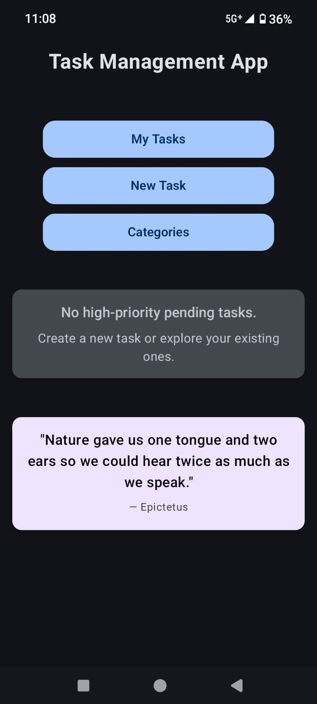
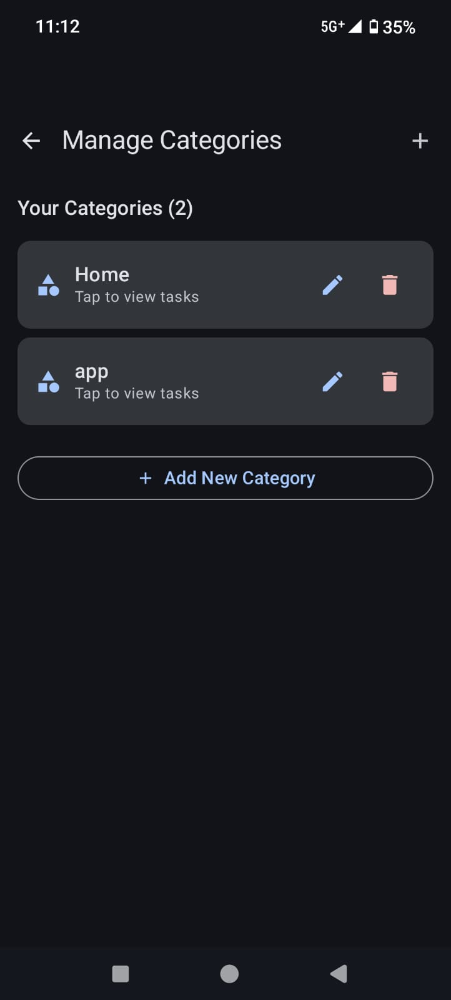
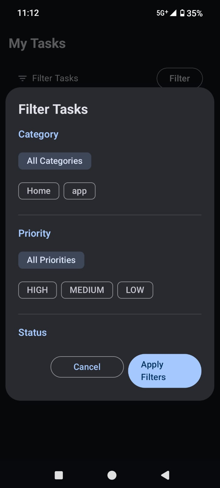

# Task Management App

A modern and efficient Android application that helps users manage their daily tasks with ease. Built using **Jetpack Compose**, the app follows **Clean Architecture** and utilizes **Room Database**, **Kotlin Coroutines**, and a remote quote API to enhance user experience.

---

## Key Features

- Add, edit, and delete tasks
- Set due date, time, priority, and category for each task
- Group tasks by category and status (Pending or Completed)
- Filter tasks by category, priority, and completion status
- View task details and update status instantly
- Manage categories (add, edit, delete)
- View motivational quotes on the home screen
- Offline caching of the last fetched quote
- Built-in dark mode support

---

## Screens in the App

- **Home Screen** – Shows quote, buttons for navigation, and high-priority tasks
- **Task List** – Displays all tasks with optional filters
- **Add/Edit Task** – Form to create or update tasks with validations
- **Task Details** – View details and quick actions for a task
- **Category Manager** – Manage custom categories

---

## Screenshots

### Home Screen


### Task List


### Add Task


### Task Details


### Category Manager


### Filter List


___

## Architecture

The app uses Clean Architecture, dividing the codebase into multiple clear layers:

com.taskmanager.app/
│
├── data/ # Data sources (Room DB, Retrofit)
├── domain/ # Business logic, UseCases, and models
├── di/ # Dependency injection setup (AppModule)
├── presentation/ # ViewModels, Screens, and Composables
├── ui/ # Theming and Material 3 setup
└── MainActivity.kt


Each layer has a specific responsibility, helping keep the codebase scalable and maintainable.


## Quote API Handling

Due to DNS resolution issues and an expired SSL certificate on the public API (`https://api.quotable.io/random`) when accessed from Android emulators, a lightweight **Flask-based proxy server** was created and deployed on **Render**:

> Proxy URL:  
> `https://quotable-proxy.onrender.com/random`

This proxy acts as a middleman:
- It forwards the request to the original Quotable API
- Avoids SSL and network issues
- Ensures consistent and reliable quote loading during development and demo

If the device is offline or the proxy fails, the app loads the **last cached quote** from local storage to prevent crashes.

---

## Getting Started

### Requirements

- Android Studio Hedgehog/Flamingo or later
- Kotlin 1.9+
- Gradle 8.0+

### Steps to Run

1. Clone the repository:
   ```bash
   git clone https://github.com/yourusername/task-management-app.git
   cd task-management-app
   
   ````
2. Open the project in Android Studio

3. Build the project and run it on an emulator or physical device

## Offline Support

- Tasks are stored locally in Room DB
- Quotes are cached locally — if the API is unreachable, the last quote is displayed

## Folder Structure Overview

├── data/
│   ├── local/      # DAOs, Entities, Room DB
│   ├── remote/     # Retrofit API + model
│   └── repository/ # Repository implementation
│
├── domain/
│   ├── model/      # Task, Quote, Priority
│   ├── usecase/    # All business logic as individual classes
│   └── repository/ # Abstract repository interface
│
├── presentation/
│   ├── components/ # Shared Composables (e.g., dropdowns, chips)
│   ├── screen/     # Home, Add/Edit Task, Task List, etc.
│   ├── navigation/ # Navigation routes and NavHost
│   └── viewmodel/  # TaskViewModel using StateFlow
│
├── di/             # AppModule for centralized DI
├── ui/             # Theme and Material color setup
└── MainActivity.kt # Entry point


